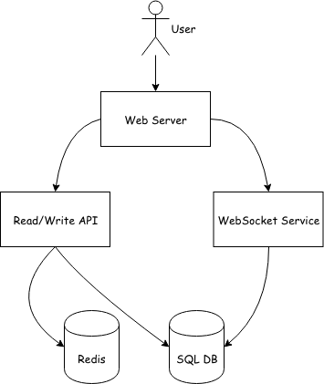
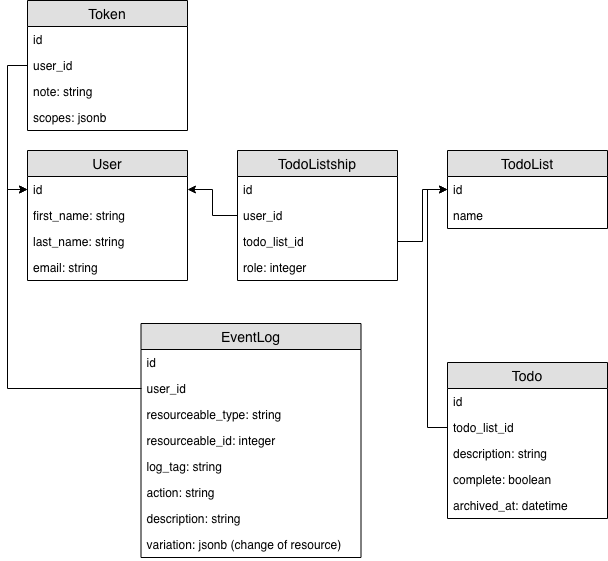

# System spec

## Use cases

* User signs in/out
* User views/creates/edits/deletes/invites member to TodoList
* User creates/edits/deletes/archives Todo
* User views EventLog
* User searches Todo #1

## Constraints and assumptions

* Traffic is not evenly distributed
* Every update for todo should apply to users without refreshing page
* 1 million active users
* 10 million new todos per day
* 50 million read requests per day
* 10 million searches per day

Calculate usage

* Size per todo
  * `todo_id` - 8 bytes
  * `user_id` - 8 bytes
  * `todo_list_id` - 8 bytes
  * `description`  ~ 30 bytes
  * `complete` - 1 byte
  * `archived_at` - 8 bytes
  * `created_at` - 8 bytes
  * `updated_at` - 8 bytes
  * Assume ~ 100 bytes ~ 0.1 KB
* 10 million todo/day * 0.1 KB ~ 1 GB per day
  * 30 GB per month
  * 365 GB per year
* 58 read requests per second
* 12 new todo requests per second
* 12 search requests per second

## High-level design

https://www.draw.io/#G1KF_OIeRQkhsfWZajTnZKSdSzXj5QHsyt

Actions such as CRUD of `Todo` and create/delete of `TodoList` should update immediately to users. `WebSocket Service` handles those actions. Other actions can be done by `Read/Write API`.

## Database schema

https://www.draw.io/#G1Wwmv8O3JBPwBJYDkv_3AvkWu05YHC4m2

`User` has many `TodoList` through `TodoListship`. There are three roles: owner, admin, and user.

Role | user | admin | owner
-------------- | ------|-------|-----
read TodoList  | ️️V | V | V
create TodoList| V | V | V
update TodoList| V | V | V
invite member to TodoList| X | V | V
delete TodoList| X | X | V

`EventLog` is used to record every action of a user. Such as user creates `TodoList`, user updates `Todo` or user invites a member to `TodoList`.
